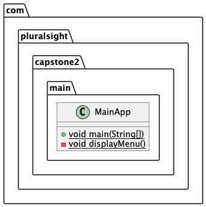
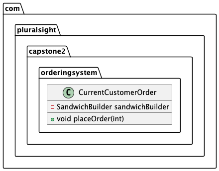
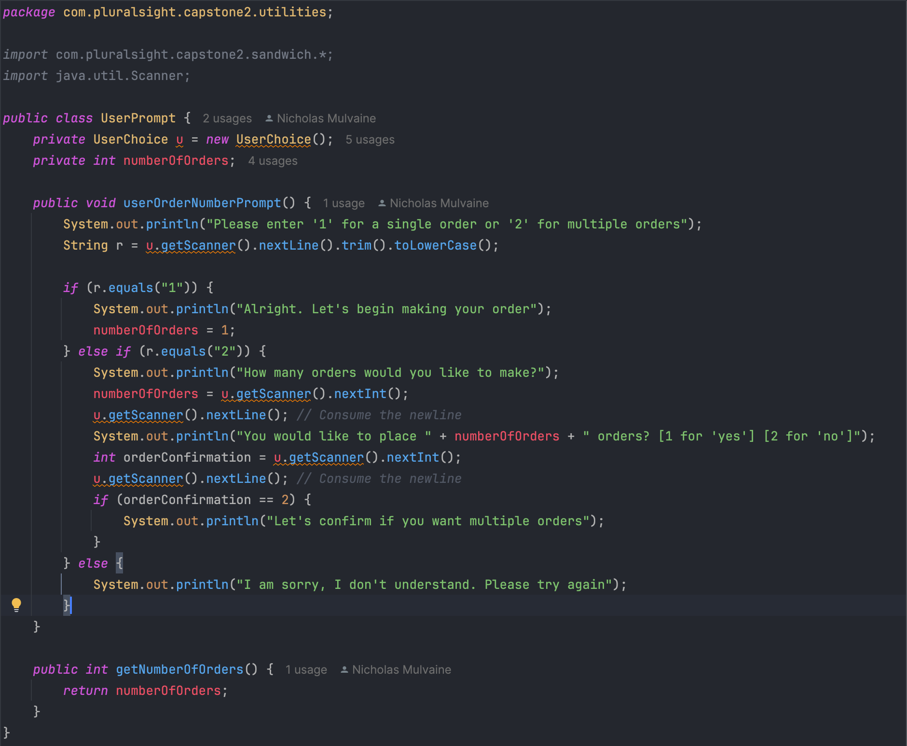
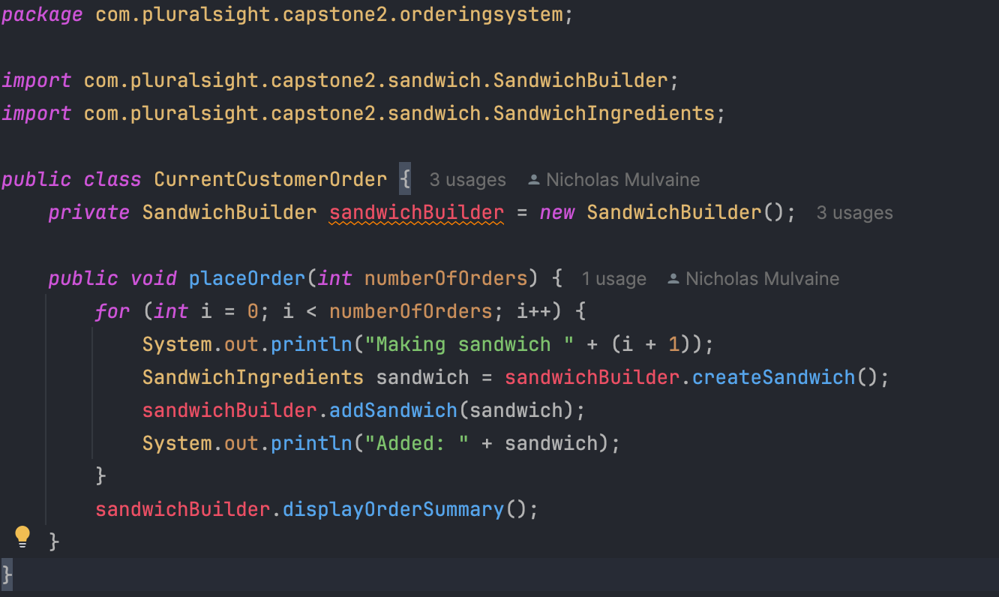

Capstone 2 Deli-Cious

Description:
A Java based interface collecting user input for a sandwich
ordering system. The project features 10 classes across four
packages

What worked:
Keeping it simple... mostly. Starting from a single point at
the start helped in keeping classes and methods orderly. As 
Friday (11/15) approached, there was a bit more of a rush and
order got lost a bit.

What didn't work: Generics is unfortunately a casualty of the
Friday deadline crunch. As the project grew, functionality got
mixed up and ultimately didn't pan out. Time management has
claimed another. 

What was attempted:

What was learned:

What to try next time:
Interfaces. There are some classes in this project that could
benefit from utilizing these.
OpenCSV and utilizing external repos

